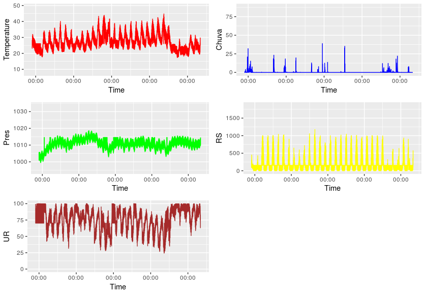
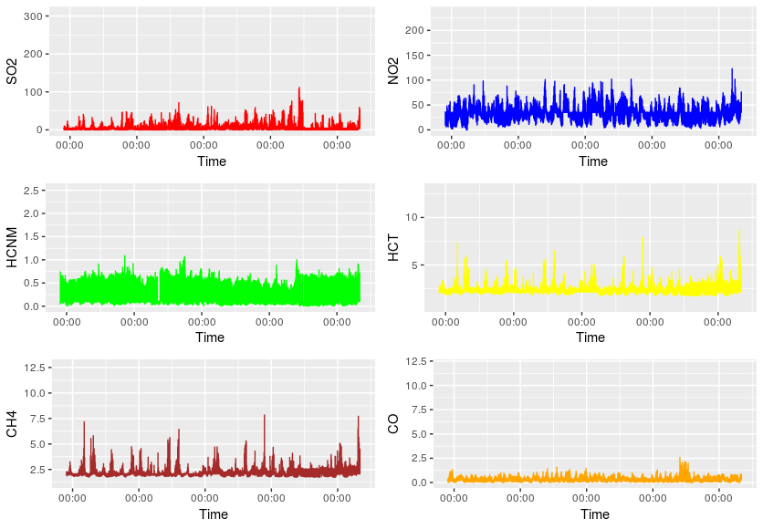

# DataMiningProject

Projeto Final da disciplina Extração e Mineração de Dados, período 2018.2.

O projeto consiste em implementar o que está descrito em  http://www.rio.rj.gov.br/web/smac/ar-do-rio, que consiste em realizar previsões de níveis de poluentes em diferentes pontos da cidade. Este é, portanto um problema de regressão, onde, a partir da base de dados é dado um número como resposta. A Prefeitura Municipal do Rio de janeiro dispõe de estações de monitoramento da qualidade do ar pela cidade, e em http://siurb-pcrj.hub.arcgis.com/datasets/5b1bf5c3e5114564bbf9b7a372b85e17_2 está disponível uma base de dados de coleta de dados desde 2011 até 2018. Segundo a descrição da base de dados, são 8 estações de monitoramento na cidade do Rio de Janeiro, são elas: 1 - Copacabana (AV), 2 - Bangu (BG), 3 - Centro (CA), 4 - Campo Grande (CG), 5 - Irajá (IR), 6 - Pedra de Guaratiba (PG), 7 - São Cristóvão (SC), 8 - Tijuca (SP). A base de dados dispõe de dados atmosféricos, como Velocidade e Direção do Vento, Umidade Relativa do Ar, Temperatura, Pressão Atmosférica, Radiação Solar, entre outras; e informações de poluentes, como Hidrocarbonetos Totais (HCT), Monóxido de Nitrogênio (NO), Monóxido de Carbono (CO), Óxidos de Nitrogênio (NOx), entre outros.

O primeiro passo foi realizar o pré-processamento, retirando dados desnecessários para a análise e retirando dados NA. Depois, uma amostra de dados de 24 horas foi escolhida e seus gráficos foram plotados, para a verificação inicial de possíveis influências dos dados entre si. A Figura 1 e a Figura 2 mostram os plots dessas amostras.

**Figura 1:** Dados meteororológicos de uma amostra de 24 horas  

**Figura 2:** Dados de poluentes de uma amostra de 24 horas 

O próximo passo foi dividir a base de dados de acordo com as 8 estações meteorológicas existentes, para que se trabalhasse individualmente com os dados de cada estação. Logo após, foi feito o cálculo das correlações entre as colunas, para verificar quais as colunas que tivessem o maior coeficiente de correlação e, então, aplicar os algoritmos de regressão para a realização da previsão. As correlações consideradas estavam nos níveis de moderado (0,4) a muito alto (1,0), para valores positivos ou negativos. A análise da correlação mostrou que, na base de dados considerada, o aumento dos níveis de poluentes não é influenciado pelos fatores atmosféricos, um fator atmosférico influencia no outro e um poluente influencia no outro. A análise foi feita individualmente em cada uma das 8 partições da base e na base de dados completa, e o resultado foi semelhante para todos os casos. 

Por fim, o algoritmo de Random Forest foi utilizado para a previsão dos poluentes. 
