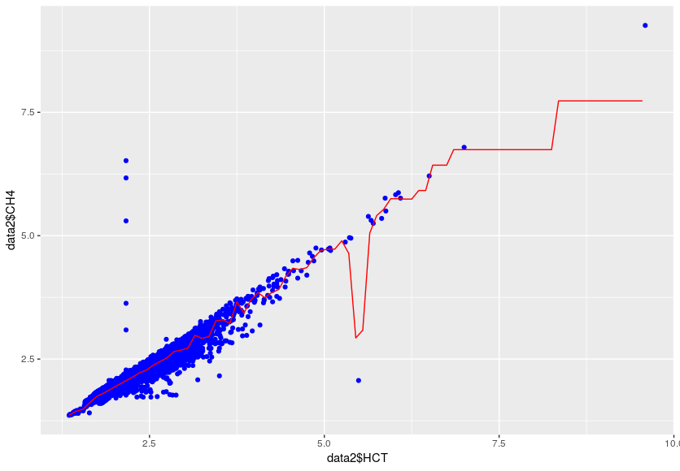

# DataMiningProject

## Projeto Final da disciplina Extração e Mineração de Dados, período 2018.2.

O projeto consiste em implementar o que está descrito em  http://www.rio.rj.gov.br/web/smac/ar-do-rio, que consiste em realizar previsões de níveis de poluentes em diferentes pontos da cidade. Este é, portanto um problema de regressão, onde, a partir da base de dados é dado um número como resposta. A Prefeitura Municipal do Rio de janeiro dispõe de estações de monitoramento da qualidade do ar pela cidade, e em http://siurb-pcrj.hub.arcgis.com/datasets/5b1bf5c3e5114564bbf9b7a372b85e17_2 está disponível uma base de dados de coleta de dados desde 2011 até 2018. Segundo a descrição da base de dados, são 8 estações de monitoramento na cidade do Rio de Janeiro, são elas: 1 - Copacabana (AV), 2 - Bangu (BG), 3 - Centro (CA), 4 - Campo Grande (CG), 5 - Irajá (IR), 6 - Pedra de Guaratiba (PG), 7 - São Cristóvão (SC), 8 - Tijuca (SP). A base de dados dispõe de dados atmosféricos, como Velocidade e Direção do Vento, Umidade Relativa do Ar, Temperatura, Pressão Atmosférica, Radiação Solar, entre outras; e informações de poluentes, como Hidrocarbonetos Totais (HCT), Monóxido de Nitrogênio (NO), Monóxido de Carbono (CO), Óxidos de Nitrogênio (NOx), entre outros.

O primeiro passo foi realizar o pré-processamento, retirando dados desnecessários para a análise e retirando dados NA. Por exemplo, há, na base de dados, colunas que referenciam a Latitude e a Longitude das estações meteorológicas, e as mesmas coordenadas de acordo com o SIRGAS 2000, que é uma forma de referenciar as localidades da América, como a Latitude e a Longitude. Havia, também, um campo com as siglas referentes às estações meteorológicas e outra que representa o mesmo, porém com números. A com as siglas foi retirada, para evitar redundância e por ser de atributos categóricos. Os dados que eram NA foram substituídos pela média da coluna. O formato de data também foi mudado para UTC.

Depois, uma amostra de dados de 24 horas foi escolhida e seus gráficos foram plotados, para a verificação inicial de possíveis influências dos dados entre si. A Figura 1 e a Figura 2 mostram os plots dessas amostras.

**Figura 1:** Dados meteororológicos de uma amostra de 24 horas  

**Figura 2:** Dados de poluentes de uma amostra de 24 horas 

Os plots das Figuras 1 e 2 não apresentam relações diretas entre os dados, apenas relações individuais, como, em que período do dia eles aumentam ou diminui, mas, ainda assim, fica difícil de ver relações entre eles.  

O próximo passo foi dividir a base de dados de acordo com as 8 estações meteorológicas existentes, para que se trabalhasse individualmente com os dados de cada estação. Logo após, foi feito o cálculo das correlações entre as colunas, para verificar quais as colunas que tivessem o maior coeficiente de correlação e, então, aplicar os algoritmos de regressão para a realização da previsão. As correlações consideradas estavam nos níveis de moderado (0,4) a muito alto (1,0), para valores positivos ou negativos de correlação. A análise da correlação mostrou que, na base de dados considerada, o aumento dos níveis de poluentes não é influenciado pelos fatores atmosféricos, um fator atmosférico influencia no outro e um poluente influencia no outro. As únicas influências de fatores atmosféricos em uma substância foram Velocidade do Vento no Ozônio (O3) e Radiação Solar no Ozônio, que não é um poluente, mas um elemento importante para a proteção da Radiação Solar. A análise foi feita individualmente em cada uma das 8 partições da base e na base de dados completa, e o resultado foi semelhante para todos os casos. O que muda é que, como em algumas estações certos poluentes não são medidos e, portanto, algumas estações possuem mais dados medidos que outras, tais estações possuem mais correlações moderadas ou altas que as que medem menos poluentes. 

Por fim, o algoritmo de Random Forest foi utilizado para a previsão dos poluentes. O algoritmo de Random Forest utiliza várias árvores de decisão executando ao mesmo tempo para dar um valor mais acurado de regressão. O *rSquared* é utilizado para medir a proporção de variância da variável dependente é predizível da variável independente, ou seja, é um menos os valores reais menos os que foram obtidos pelo algoritmo elevado ao quadrado dividido pela variância total, matematicamente falando. Os gráficos seguintes mostram alguns gráficos de correlação de algumas estações e o gráfico que prevê a quantidade de poluentes, obtido pelo algoritmo de Random Forest.

**Figura 3:** Previsão de PM10 influenciado pelo CO na estação 7

**Figura 4:** Previsão de HCT influenciado pelo CH4 na estação 2

**Figura 5:** Previsão de NO2 influenciado pelo NOx na estação 8

**Figura 6:** Previsão de NOx influenciado pelo CO na estação 2

**Figura 7:** Previsão de NOx influenciado pelo PM10 na estação 2

**Figura 8:** Previsão de PM10 influenciado pelo PM2_5 na estação 5

**Figura 9:** Previsão de SO2 influenciado pelo CO na estação 1